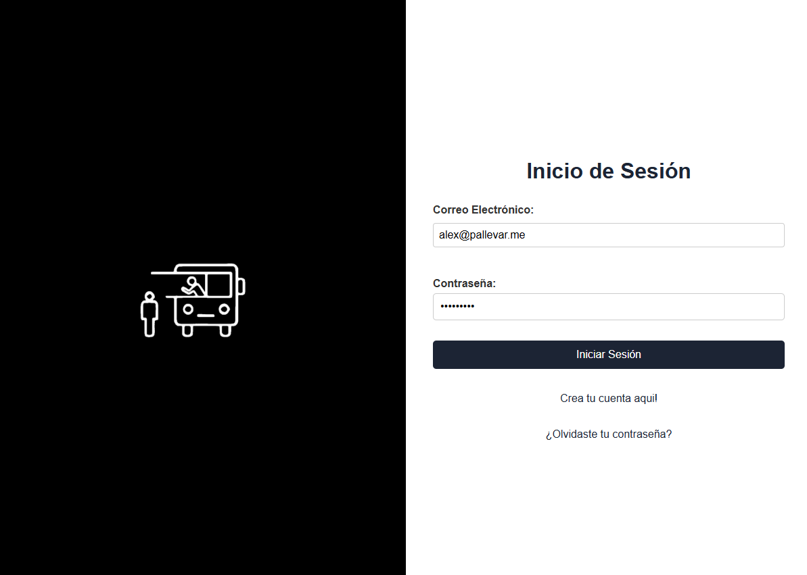

# Introducción al Panel Administrativo

El **panel administrativo de Pallevar** es la herramienta clave que permite a los restaurantes gestionar de manera eficiente todas las operaciones relacionadas con su menú, pedidos, estadísticas y más. Este panel está diseñado para ser intuitivo y fácil de usar, brindando a los administradores una visión completa y control sobre su negocio.

A continuación, te proporcionamos una introducción al panel administrativo, sus funcionalidades principales y cómo puedes empezar a utilizarlo para optimizar la gestión de tu restaurante.

## 1. Acceso al Panel Administrativo

El panel administrativo está disponible en un subdominio exclusivo para restaurantes: **[mimenu.pallevar.me](https://mimenu.pallevar.me/)**. Para acceder, solo necesitas ingresar tus credenciales (usuario y contraseña) proporcionadas al momento de registrarte en la plataforma.

#### Pasos para acceder:
- Dirígete a la URL de tu panel administrativo.
- Ingresa tu nombre de usuario y contraseña.
- Haz clic en el botón de inicio de sesión para acceder a la interfaz principal.

  

## 2. Funcionalidades Principales del Panel Administrativo
El panel administrativo de Pallevar está dividido en varias secciones clave, cada una diseñada para facilitar la gestión diaria de tu restaurante.

### 2.1. Gestión de Menú
En esta sección, podrás añadir, editar o eliminar platillos en el menú de tu restaurante. Puedes organizar los platillos en categorías (por ejemplo, Entradas, Platos Principales, Postres) y gestionar sus precios, descripciones e imágenes. Esta sección también te permite actualizar el estado de disponibilidad de los platillos en tiempo real.

### 2.2. Gestión de Pedidos
Aquí podrás ver todos los pedidos realizados por los clientes a través de tu plataforma. La vista de pedidos te permite filtrar y organizar los pedidos según su estado (por ejemplo, "En preparación", "Listo para recoger"). También podrás actualizar el estado de los pedidos y gestionarlos desde esta misma sección.

### 2.3. Estadísticas y Reportes
Esta sección proporciona información detallada sobre el rendimiento de tu restaurante, como ventas diarias, mensuales y la cantidad de pedidos realizados. También podrás ver gráficos e informes que te ayudarán a tomar decisiones basadas en datos, mejorando la eficiencia y rentabilidad de tu negocio.

### 2.4. Configuración de Perfil y Preferencias
En esta sección, puedes configurar los detalles de tu restaurante, como nombre, dirección, horarios de atención y preferencias de pago. También podrás gestionar los métodos de pago y los ajustes de facturación.

## 3. Navegación en el Panel Administrativo
El panel está diseñado para ofrecer una experiencia de usuario fluida. Utiliza una barra de navegación lateral con enlaces rápidos a las secciones más utilizadas, y un menú superior para opciones adicionales como el perfil de usuario y configuraciones generales.

#### Secciones destacadas en la barra lateral:
- **Menú:** Para gestionar los platillos y categorías.
- **Pedidos:** Para ver y administrar los pedidos de los clientes.
- **Estadísticas:** Para acceder a reportes y gráficos.
- **Configuración:** Para personalizar los datos del restaurante.

## 4. Recomendaciones para Comenzar
#### Para empezar a utilizar el panel administrativo de manera eficiente, te recomendamos seguir estos pasos:

- **Configura tu perfil:** Asegúrate de ingresar toda la información relevante de tu restaurante (nombre, dirección, horarios).
- **Añade tus platillos al menú:** Comienza cargando tus platillos, asignando precios y categorías.
- **Empieza a gestionar los pedidos:** Revisa los pedidos que recibas y actualiza su estado según corresponda.
- **Consulta las estadísticas:** Accede a los reportes para evaluar el rendimiento de tu restaurante y tomar decisiones informadas.

 